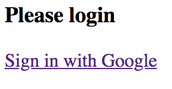

### Sample Google OAuth Token Authentication

A simple example on how to use Google OAuth as an identity provider for your JWT secured services.

#### Pre-requisites

To run this app, you'll need an app registered with Google. You can go to your
[Google Developer Console](https://console.developers.google.com/project) and create one there or use
one that you already have.

You'll need to pass the client ID and client secret so the permissions screen from Google will show
the correct app name. To do that, you just pass them as arguments when starting this application,
like the following:
 
```
java -jar build/libs/GoogleOAuthWithTokenAuthentication.jar \
  --oauth.google.clientId=${YOUR_GOOGLE_APP_CLIENT_ID} \
  --oauth.google.clientSecret=${YOUR_GOOGLE_APP_CLIENT_SECRET}
```

You can also set these in your IDE inside your run configuration passing them as program argument.

You also need to set the authorized redirect URL to point to:
```
http://localhost:8080/authenticate/oauth2callback
```

#### How it works

After starting the application, you can go to http://localhost:8080 and you'll be redirected to the
login screen if you never signed in before. The login screen looks like the following:

<p style="text-align:center">

When you click on the `Sign in with Google` link, it will take you to the Google authentication
screen (or if you had given the authorization for this app before it will automatically redirect
you back). After signing in you'll be authenticated by the `GoogleOAuthController` which will render
a Thymeleaf template that has some Javascript code that stores the token in `localStorage` then
redirects to `index.html`. The following is an overview of the flow:

```
         +-----------+          +---------+             +--------+
         |Application|          | Browser |             | Google |
         +----+------+          +----+----+             +---+----+
              |                      |                      |
              |  login.html          |                      |
              |---------------------->                      |
              |                      |                      |
              |                      |   Click login        |
              |                      +---------------------->
              |                      | Google login screen  |
              |                      <----------------------+
              |                      |                      |
              |                      | Login w Google creds |
              |                      +---------------------->
              |                      |    Redirect to app   |
              |                      <----------------------+
              |Redirect to controller|                      |
         +---+<----------------------+                      |
         |    |                      |                      |
 Authenticate |                      |                      |
         |    |                      |                      |
         +----> Render template with |                      |
              |JWT token and store it|                      |
              |   on local storage   |                      |
              +---------------------->                      |
              |    Redirects to home |                      |
              <----------------------+                      |
              | index.html           |                      |
              +---------------------->                      |
              |                      |                      |
              |                      |                      |
```
